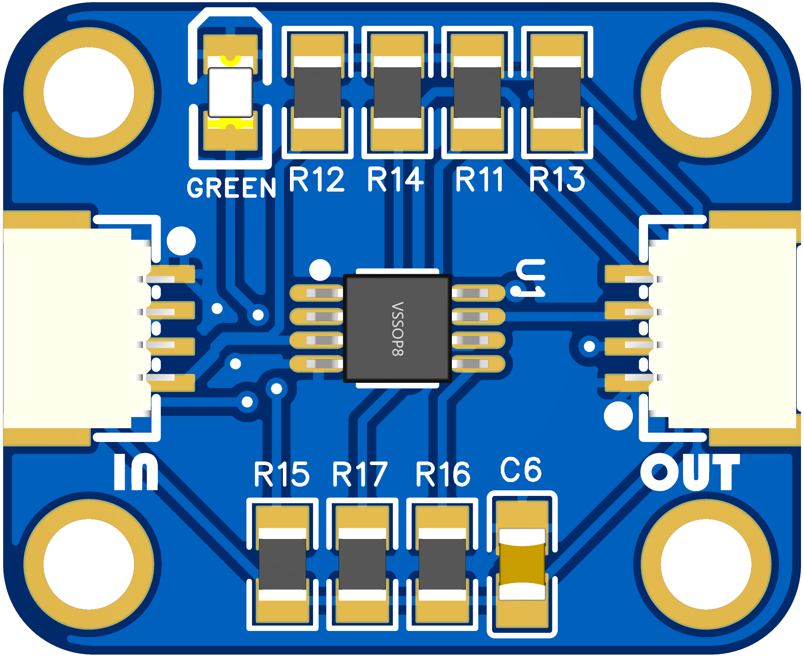
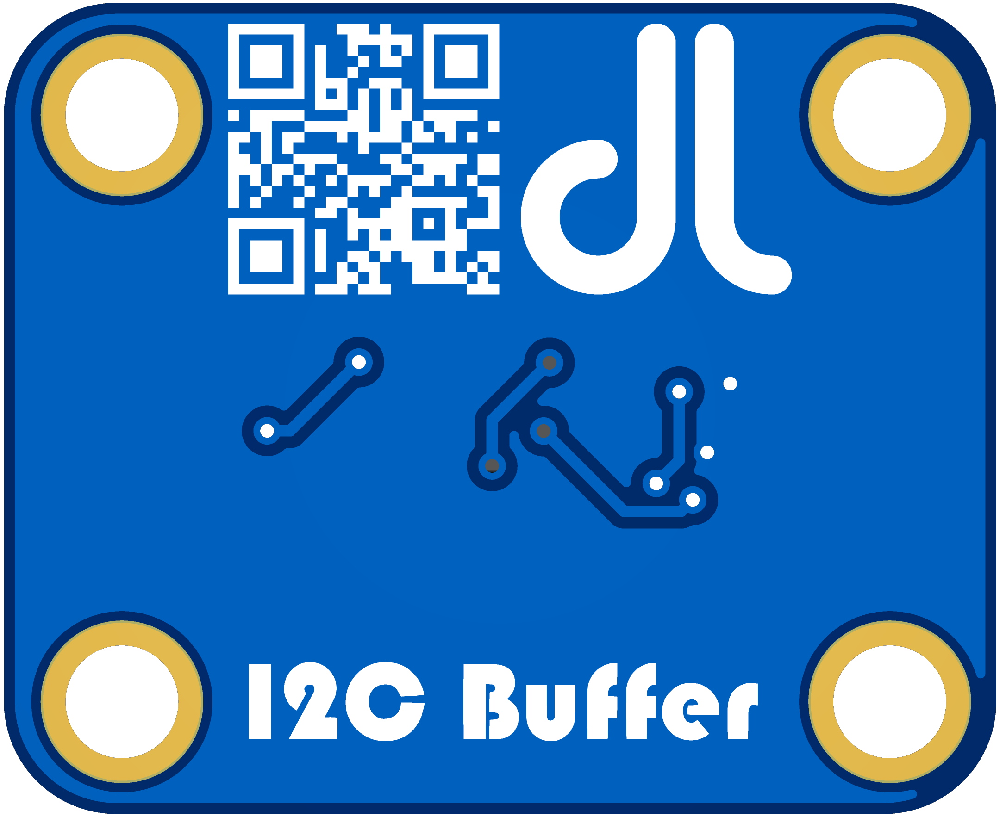
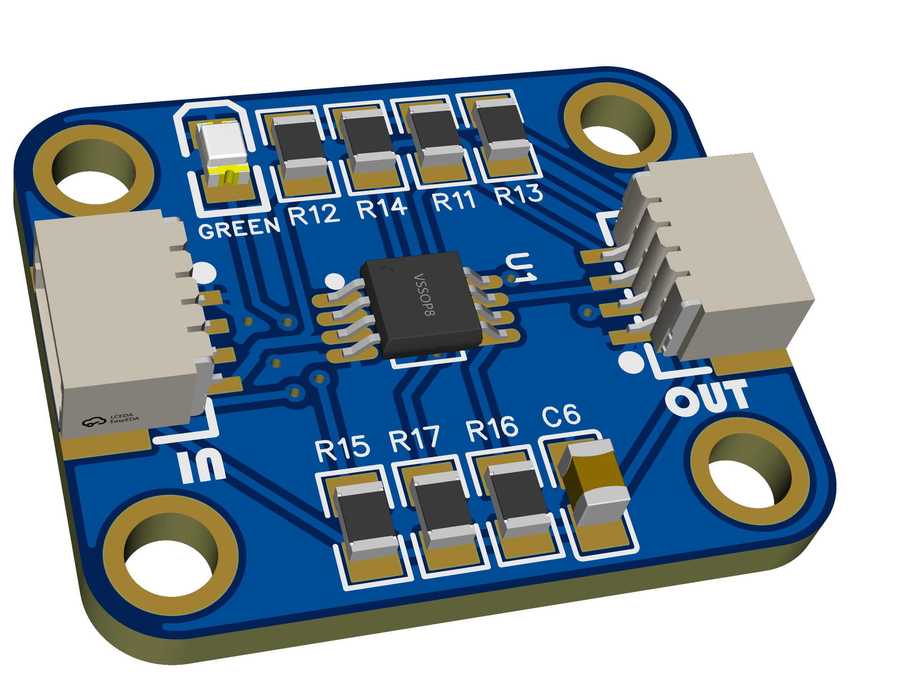
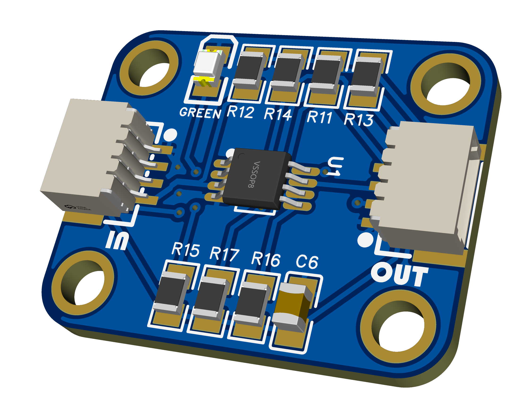
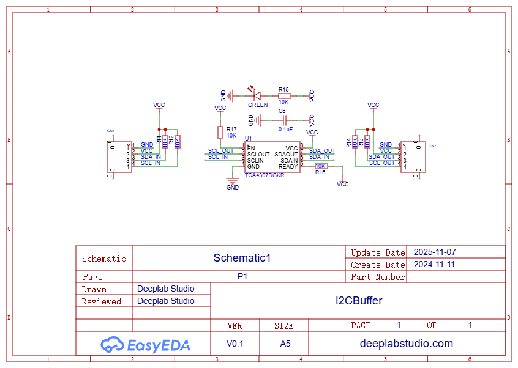

# I2C-Buffer
A compact and reliable **PCA9515A-based I²C Buffer** board designed to extend and stabilize I²C communication between multiple devices or long cable runs.  
The board isolates two I²C buses (A and B sides), protecting each side from bus capacitance issues and signal degradation.  
It’s fully compatible with **3.3V and 5V logic levels**, making it ideal for mixed-voltage systems and long-distance I²C communication.

## PCB

  
  
  
  

---
### Schematic

---
## ⚙️ Features
- **IC:** PCA9515A (I²C Bus Buffer)  
- **Logic Level Support:** 3.3V ↔ 5V bi-directional  
- **Bus Isolation:** Independent A-side and B-side I²C lines  
- **Interface:** Standard SDA/SCL lines  
- **Connector Type:** STEMMA QT / Qwiic compatible (optional)  
- **Use Cases:**  
  - Long-distance I²C communication  
  - Multi-device I²C networks  
  - Mixed voltage systems (3.3V and 5V)  
  - Bus isolation and noise reduction

---
## Donate

